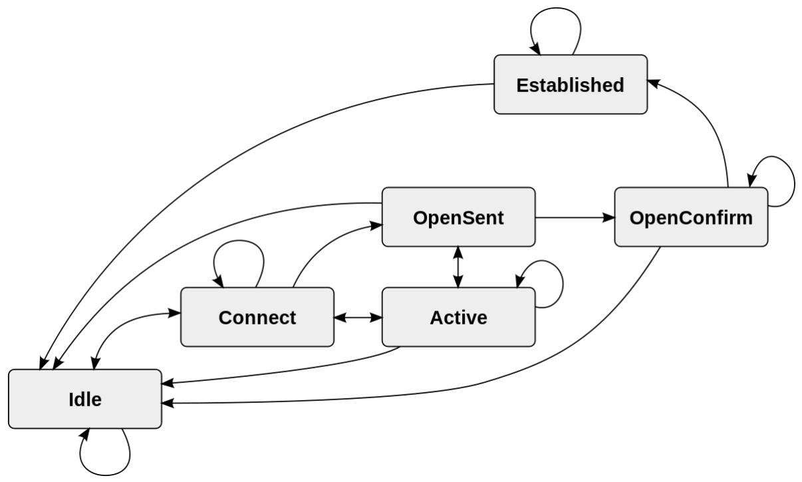

# ASG

## Launch template vs launch configuration

* it's recommended to use launch templates as they can be versioned and supports latest EC2 features.

## EC2 Termination

terminate an instance in ASG without changing its desired capacity

```
terminate-instance-in-auto-scaling-group --instance-id <value>  --no-should-decrement-desired-capacity
```

## Suspended processes

* If you suspend **AZRebalance** and a scale-out or scale-in event occurs, the scaling process **still tries to balance the Availability Zones**. For example, during scale-out, it launches the instance in the Availability Zone with the fewest instances.
* AZRebalance balances the number of EC2 instances in the group evenly across all of the specified Availability Zones when the group becomes unbalanced, for example, when a previously unavailable Availability Zone returns to a healthy state

- If you suspend the **Launch** process, **AZRebalance neither launches new instances nor terminates existing instances**. This is because AZRebalance terminates instances only after launching the replacement instances.

- If you suspend the **Terminate** process, your Auto Scaling group can grow up to **10%** larger than its maximum size because **this is allowed temporarily** during rebalancing activities. If the scaling process cannot terminate instances, your Auto Scaling group could remain above its maximum size until you resume the Terminate process.


## Scale in protection

It's possible to [protect resources from scaling in](https://docs.aws.amazon.com/autoscaling/ec2/userguide/ec2-auto-scaling-instance-protection.html#instance-protection-instance)

* at EC2 instance level
* at ASG level

Sample command

```
aws autoscaling set-instance-protection --instance-ids i-5f2e8a0d --auto-scaling-group-name my-asg --protected-from-scale-in
```

## Step vs simple scaling policy

* Step apply only a percentage to change
* Simple can apply a percentage and a number of instances

# S3

* HTTP error 503 Slow Down indicates that the number of requests to your S3 bucket is high. It can indicate a bucket where one or multiple objects have millions of versions.
* a Content-MD5 value can be passed as a request header to check the integrity of the file
* MFA Delete. Without MFA
  * cannot delete any object
  * cannot disable versioning state of a cluster
  * can only be activated by the root account using AWS CLI
* Separate lifecycle policies must be written for current objects versions and previous object versions on a bucket with versioning enabled.
* To delete a bucket with versioning enabled
  * delete programatically the bucket with SDK
  * use lifecycle configurations to delete objects
  * use S3 console
  * CLI cannot be used, it does not work on versioning enabled buckets.
* CRR can copy directly on Glacier if needed (even Deep Archive), no need to create lifecycle policies
* Replication Time Control (RTC) : copy all objects within 15 min. Includes S3 replication metrics and S3 event notifications. It monitors the copies that are pending, total size of pending objects, maximum replication time
* S3 inventory can also be used to monitor replication status
* It's possible to receive 5xx errors from S3 at rare occasions. A retry will probably fix the issue

# Glacier

* To save costs on Glacier it's better to store large files over small files
  * A fixed amount of storage is added to the objects which are used for metadata
  * There is a one time transition charge to Glacier, per object.

* Glacier Vault lock will complete within **24 hours** using LockID generated during initiate Vault Lock


# KMS

Provide these headers to encrypt with a customer provided key

* x-amz-server-side​-encryption​-customer-**algorithm** (must be AES256)
* x-amz-server-side​-encryption​-customer-**key** (256-bit, base64-encoded encryption key)
* x-amz-server-side​-encryption​-customer-**key-MD5** (a digest to check key has not been altered)
* x-amz-server-side​-encryption​ is used to designated the encryption mode (AES-256, aws:kms)


# RDS

RDS Proxy can improve high availability when a failover occurs

# EC2

* if EC2 stays in Pending state and terminates, it can be due to :
  * EBS volume limit has been reached
  * EBS Snapshot is corrupted
  * Root EBS volume is encrypted and you don't have permission on the key 

* To aggregate EC2 instances metrics, it is necessary to activate detailed monitoring

* Amazon-issued certificate cannot be installed in EC2. Third party certificates must be installed to have an end-to-end SSL workload

* you can only share AMIs is there are unencrypted or encrypted with a customer managed CMK

## Termination policy

* termination protection is not possible on Spot instances
* does not prevent ASG from terminating an instance
* use instance protection instead to prevent ASG to scale-in
* When the attribute InstanceInitiatedShutdownBehavior is set, the instance can initiate its shutdown event if termination has been set

# ALB

* S3 bucket for access logs must be in the same region but can be in a different account
* If all instances of a target group are unhealthy, ALB will forward requests to them. It's only when there is at least one healthy, that ALB redirects only to the healthy target

## Sticky Session
* sticky sessions can be defined at the **target group** level
* Based on cookies
  * Duration-based stickiness : cookie named AWSALB
  * Application-based stickiness
    * It allows users to maintain stickiness across load balancers that are chained together

## Listener Rules

* by default, ALB considers last value of query parameters when calling a lambda function. **Multi-value** headers must be enabled to pass all query parameters to a lambda


# IAM

* IAM Identity Center uses permission sets to define policies. Permission sets ultimately get created as IAM roles in a given AWS account, with trust policies that allow users to assume the role through the AWS IAM Identity Center
* in IAM Policies, keywords aws:username or aws:userid can be used to create dynamic policies. aws:userid is better because there is no unicity guarantee on aws:username
* The only resource-based policy that IAM supports is the trust policy

# Microsoft AD

* Use AWS Directory Service for Microsoft Active Directory (Standard Edition or Enterprise Edition) if you need an actual Microsoft Active Directory in the AWS Cloud that supports Active Directory–aware workloads, or AWS applications and services such as Amazon WorkSpaces and Amazon QuickSight, or you need LDAP support for Linux applications.
* Use AD Connector if you only need to allow your on-premises users to log in to AWS applications and services with their Active Directory credentials. You can also use AD Connector to join Amazon EC2 instances to your existing Active Directory domain.
* Use Simple AD if you need a low-scale, low-cost directory with basic Active Directory compatibility that supports Samba 4–compatible applications, or you need LDAP compatibility for LDAP-aware applications.

[Cheat sheet](https://tutorialsdojo.com/aws-directory-service/)

# Cloudfront

* Reports
  * Cache statistics : hit, misses and errors
  * popular objects : nb of requests, hit/misses/errors
  * top referrers: domains of websites that originated the most HTTP and HTTPS requests
  * usage reports: nb requests by destination and protocol
  * viewer reports: type of devices, browsers operating systems and locations

* Websocket
  * The client send an HTTP request with the upgrade protocol header. 
  * Server responds to it and connectivity over WebSocket protocol is established

* when origin is a S3 
  * in static web hosting, not possible to communicate with HTTPS between S3 and Cloudfront. But still CloudFront can be configured in HTTPS. 
  * otherwise, the protocol will be Match Viewer

* OAI cannot be used with S3 in static web hosting mode
* Error 4XX or 5XX
  * when origin returns error, Cloudfront can cache them, but cloudfront itself does not generate any error.

# WAF

* regarding AWS managed rules, rules cannot be changed, but action can be changed to count, allowing traffic
* Sampled requests are available for 3 hours on AWS management console
* Regional or Global WebACL can be created. Global WebACL must be created in region us-east-1


# Cloudwatch

* it's possible to aggregate mutliple configuration files by using append-config option. File names must be different
* cloudwatch:PutDashboard to create or update dashboard. There is no cloudwatch:createDashboard
* Cloudwatch Agent uses open source tools to collect metrics
  * on Linux : StatsD or collectd
  * on Windows : only StatsD is supported
* Alarm history retention is 14 days

## Synthetics

* cloudwatch synthetics is a node.js script that can be used to simulate a user traffic. It can be run on a schedule. It's used to detect issues before the customer.
* There are UI canaries that offer programmatic access to a headless Chrome browser via [Puppeteer](https://developer.chrome.com/docs/puppeteer)

# Route 53

* not possible to configure health checks details on an ALIAS record

# Site-to-site VPN

* BGP is a TCP protocol with default port 179
* TunnelState metric can be used to determine the status of VPN tunnel. It will be 1 when BGP state is an established state. For other states it will be 0.
  




# EBS

* EBS Direct API can be used to create EBS snapshots, **read data** from snapshots, and **identify differences** between snapshots.
* To resolve performance degradation on first time access due to a restore
  * For initialization of the entire volume. IT can take a lot of time depending on instance size and bandwidth supported.
  * Enable fast snapshot (additional charges)
* First time access can be slow because EBS make volume available asap, but data loading is still loading in background. If a process access a block that was not yet loaded, EBS will upload the block from s3 to restore it (lazy loading). This is the cause of latency.

# Storage Gateway

* HA mode for storage gateway
  * Supported on VmWare only
    * A cluster with vSphere HA enabled
    * A shared datastore
* CachePercentDirty is a metric that indicates the amount of data that has not yet been loaded on S3 when using a File Gateway.

# Inspector

* assessment templates requires two mandatory parameters
  * duration (frequency of scans)
  * Rules Packages

# Shield

* Network ACLs are changed if attacks are on layer 3 or 4
* WAF ACLs are updated if attacks are on layer 7
* AWS support center must be contacted so that AWS Shield Response team can engage DDoS experts to mitigate DDoS attacks.
* cloudwatch metrics under namespace AWS/DDoSProtection (Advanced Shield only)

# GuardDuty

* GuardDuty sends initial events notifications within 5 minutes of the findings and all subsequent findings every 6 hours.

# Cost and Usage Report

* can have multiple files
  * a set of data files that contain all usage line items
  * separate files for discounts
  * manifest file listing data files in a report
  * flexible column structure


# CloudTrail

Creating Trails 
* requires providing **bucket ARN** of member accounts
* no additional cross account access is required
* the S3 in console listing is only for the master account

# Config

* not necessary to have AWS Organizations to use aggregator
  * just specify accounts & regions individually in Aggregator
  * authorize Aggregator account to collect Config configuration and compliance data
* Pricing is based on 
  * number of config items recorded
  * number of active rule evaluations
  * number of conformance pack evaluations
* AWS Config does not record S3 Glacier Vaults. a custom rule must be used for that end that uses a Lambda.

# Datasync

* datasync agent must be created in the destination region
* resources can be in different region
* resources can be in different account but only following this [table](https://docs.aws.amazon.com/datasync/latest/userguide/working-with-locations.html#working-with-locations-across-accounts)

# Elasticache

## Redis


* CPUUtilization and EngineCPUUtilization can be used to understand CPU utilization for Redis clusters. EngineCPUUtilization provides additional visibility to CPU utilization of the Redis process level.
* when Redis is in multi AZ
  * replication is asynchronous
  * When primary node is rebooted, it's cleared of data. When it comes back online, the read replicas are cleared too, and it results in data loss.
  * Can manually promote read replicas to primary only when Multi AZ **AND** automatic failover are **disabled**
  * When choosing the read replica to promote, Redis takes the one with the least replication lag

# RAM

when a resource is shared via RAM, both owners and granted principals can receive Eventbridge events generated by the resource (near real time delivery)

# VPC 

## VPC Peering

* VPC peering with IPv6 is supported BUT You cannot peer 2 VPCs if their IPv4 CIDRs are overlapping and their IPv6 CIDRs don’t overlap

## Traffic mirroring

* Traffic mirroring can be used to do deep packet inspection, and is activated at an ENI level. Targets can be ENIs, NLB or GLB.

## VPC Flow logs

* after creating a flow log configuration, it's not possible to change it. If for example an IAM role is not correctly configured, a new configuration must be re-created.

# Network firewall

* Network firewall acts at a VPC level, not a subnet level

# Organizations

* Tag policies can be used to enforce tagging rules. They can prevent tags or just alert. Alerting is done via [EventBridge](https://docs.aws.amazon.com/organizations/latest/userguide/orgs_manage_policies_tag-policies-cwe.html)


# Secret Manager

* when you delete a secret, Secrets Manager deprecates it with a 7 day recovery window. It is possible with the CLI to force deletion of a secret, bypassing this window.

```
aws secretsmanager delete-secret --secret-id mysecret --force-delete-without-recovery
```

* Secret cross region replication can be activated. Keep same key name accross regions and copies
  * secrets
  * resource policies
  * rotation policies
  * tags

# Systems Manager

## Hybrid

to setup an hybrid VM
* Create an IAM Role for Hybrid environment
* Install a TLS certificate on servers
* Create a Managed-Instance Activation for hybrid environment
* Install SSM Agent
* (Optional) Enable Advanced Instances Tier for more than 1000 servers / account / region

## Documents

* AWSSupport-TroubleshootS3PublicRead to help diagnose issues with accessing objects from a public S3 endpoint

# CloudFormation

* while changeset have been validated, AWS remove them all
* to debug a user data script and needs to access cfn-init-output.log, just provide the option to avoid rolling back

```
Set OnFailure=DO_NOTHING
```

# Snowball

* not possible to copy directly data to Glacier. Must copy to S3 and then use lifecycle policies to transition to Glacier